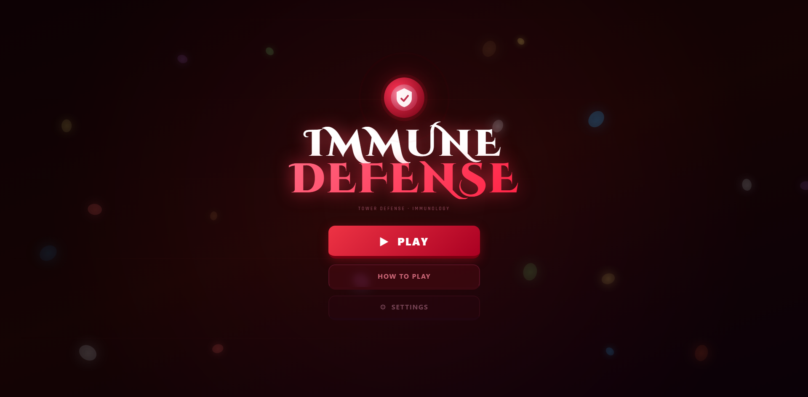
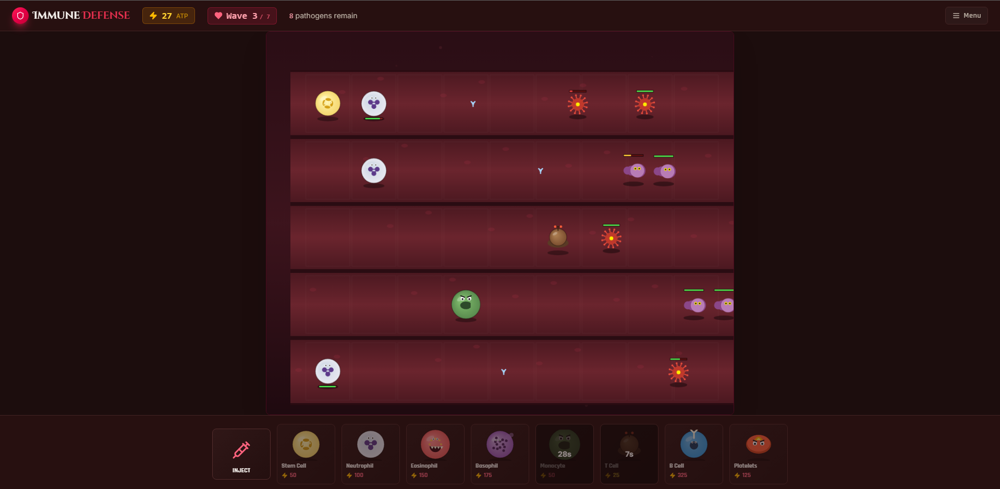
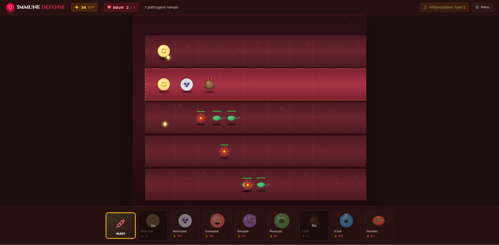
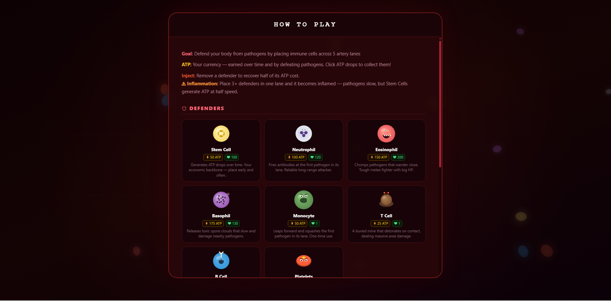

# Immune Defense: A Biological Attrition Strategy

Immune Defense is a sophisticated, browser-based tower defense experience that transports players into the microscopic battlefield of the human bloodstream. As a commander of the body’s primary line of defense, you are tasked with deploying specialized leukocytes (white blood cells) across a five-lane arterial grid to intercept and neutralize an escalating barrage of pathogenic invaders. — but watch out for inflammation!

Built with React, TypeScript, Vite, Tailwind CSS, and HTML5 Canvas.

## Game Preview

| Main Menu | Strategic Defense |
|:---:|:---:|
|  |  |
| *Dynamic menu with canvas animations* | *Active pathogen defense across 5 lanes* |

| Inflammation Mechanic | How to Play |
|:---:|:---:|
|  |  |
| *Strategic trade-offs in inflamed lanes* | *Clear in-game documentation* |

## 🌟 Key Features

*   **Dynamic Bloodstream Environment:** A custom-built HTML5 Canvas engine that simulates a flowing arterial environment with animated cell particles and scanline effects.[cite: 1, 4]
*   **Strategic Resource Management:** Balance your ATP economy by placing Stem Cells, but beware of the physical space they occupy.[cite: 4, 5]
*   **Inflammation System:** A unique "risk-vs-reward" mechanic where over-stacking a lane slows enemies but halves your resource production.[cite: 3, 5]

## 🧬 Why This Game? (Uniqueness)

Unlike standard tower defense games that use static maps, **Immune Defense** uses a biological theme to drive its core mechanics. What makes it unique is the **Inflammation Mechanic**.[cite: 3, 4] Most games encourage you to put all your power in one spot; this game punishes that behavior, forcing you to spread your defenses across all five lanes and think like a real immune system.

## 🛠 Tech Stack

| Category | Technology | Purpose |
| :--- | :--- | :--- |
| **Frontend** | React 18 & TypeScript | Component-based UI management and type-safe development. |
| **Build Tool** | Vite | Fast development server and optimized production bundling. |
| **Styling** | Tailwind CSS | Utility-first CSS framework for rapid and responsive UI design. |
| **Rendering** | HTML5 Canvas API | High-performance 2D graphics rendering without external game engines. |
| **Audio** | Web Audio API | Low-latency audio processing for spatial SFX and background music.[cite: 1] |

## 🏛 Project Architecture

| Module | File | Responsibility |
| :--- | :--- | :--- |
| **State Engine** | `engine.ts` | **The Logic Core:** Manages the game loop, physics, collision detection, and inflammation state. |
| **Graphics Layer** | `draw.ts` | **The View:** A pure-function renderer that converts game state data into Canvas visuals. |
| **Controller** | `Game.tsx` | **The Interface:** Orchestrates React components, user input listeners, and the DOM-based HUD. |
| **Configuration** | `config.ts` | **The Balance:** Centralized data for wave definitions and unit statistics (HP, cost, damage). |
| **Type System** | `types.ts` | **The Blueprint:** Defines global interfaces for entities like Defenders, Pathogens, and Projectiles. |

## Quick Start

Requires **Node.js 18+** and **npm** (or pnpm/yarn).

```bash
# Install dependencies
npm install

# Run the development server (opens http://localhost:5173)
npm run dev

# Production build
npm run build

# Preview production build
npm run preview
```

## 📖 How to Play

- **Goal:** Stop pathogens from reaching the left edge of the screen.
- **ATP** is your currency. Place **Stem Cells** to generate ATP drops — click them to collect.
- Click a defender card at the bottom, then click a cell on the grid to place it.
- **Inject** Remove a defender to recover half of its ATP cost.
- **Inflammation:** if you place 3+ defenders in a single lane, that lane becomes inflamed. Pathogens slow down inside it, but Stem Cells in inflamed lanes generate ATP at half speed. Plan your placement.
- Survive all 7 waves to win.

## Controls

| Action | Control |
|:--- |:--- |
| **Select Defender** | Click a card in the bottom HUD |
| **Place Defender** | Click an empty grid cell (after selecting a card) |
| **Collect ATP** | Click on falling/floating ATP crystals |
| **Pause Game** |  Click the Menu button |
| **Mute/Unmute** | Managed via the Settings menu |

**Pro-Tip:** You can collect multiple ATP drops at once by clicking near clusters of crystals.

### 🛡 Defenders

| Cell | Cost | Role |
| :--- | :--- | :--- |
| **Stem Cell** | 50 | Generates ATP drops |
| **Neutrophil** | 100 | Shoots antibodies forward |
| **Eosinophil** | 150 | Devours pathogens up close |
| **Basophil** | 175 | Releases damaging spore clouds |
| **Monocyte** | 50 | Squashes the first pathogen in lane (single-use) |
| **T Cell** | 25 | Buried mine, detonates on contact |
| **B Cell** | 325 | Fires antibodies in 3 lanes simultaneously |
| **Platelets** | 125 | Clots the entire lane in fire (single-use) |

### 🦠 Pathogens
| Pathogen | Threat Level | Description | Base Stats |
| :--- | :--- | :--- | :--- |
| **Prokaryote** | **LOW** | Fast rod-shaped bacteria with flagella. Weak but arrives in swarms early on. | HP: 150 \| SPD: 22 \| DMG: 6 |
| **Virus** | **LOW** | Spiky icosahedral particle — the fastest pathogen. Fragile but dangerously quick. | HP: 120 \| SPD: 28 \| DMG: 8 |
| **Parasite** | **MEDIUM** | Segmented worm that wiggles through your defenses at moderate speed. | HP: 200 \| SPD: 18 \| DMG: 8 |
| **Protozoa** | **MEDIUM** | Amoeba-like blob with pseudopods. Harder to kill and hits reasonably hard. | HP: 280 \| SPD: 14 \| DMG: 10 |
| **Fungi** | **HIGH** | Mushroom-shaped invader with high HP. Slow but absorbs a lot of punishment. | HP: 380 \| SPD: 12 \| DMG: 12 |
| **Prion** | **EXTREME** | Misfolded protein cluster — the final boss. Massive HP and crushing damage. | HP: 600 \| SPD: 10 \| DMG: 18 |

## Project Structure

```
.
├── index.html
├── package.json
├──package-lock.json
├── tsconfig.json
├── vite.config.ts
├── gitignore
├── public/
│   └── favicon.svg
├── screenshots
    ├──main_menu.png
    ├──gameplay.png
    ├──inflammation.png
    └──instruction.png
└── src/
    ├── main.tsx          # React entry point
    ├── App.tsx           # Root component
    ├── index.css         # Tailwind + theme + animations
    └── game/
        ├── types.ts      # State and entity types
        ├── audio.ts      # Sound effects of the game
        ├── config.ts     # Defender / pathogen stats, wave definitions
        ├── draw.ts       # Canvas rendering for everything
        ├── engine.ts     # Game loop, AI, collisions, inflammation
        └── Game.tsx      # React shell, HUD, defender deck, modals
```

All game logic lives in `src/game/`. Rendering is pure HTML5 Canvas no game framework.

## 👥 The Team

| Name | Role | GitHub |
|:--- |:--- |:--- |
| **Gianna Trisha M. Ainza** | Lead Developer / Game Designer | [@gianainza](https://github.com/gianainza) |
| **Ma. Isabella B. Arce** | [UI/UX & Frontend Designer ] | [@isabelalalala](https://github.com/isabelalalala) |

## 🎓 Academic Attribution

**UPHSD MOLINO — COLLEGE OF COMPUTER STUDIES**  
**Web System and Technology Final Project**  
*2-Week Sprint Game Development*

## 📄 License

MIT — This project is open-source and intended for academic demonstration. Feel free to fork and explore the biological battlefield.
